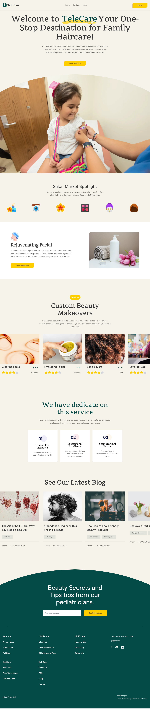

# Salon and Beauty Marketplace Website

Welcome to our Salon and Beauty Marketplace website built with Next.js! This
platform offers a seamless experience for users to explore services, schedule
appointments, and connect with beauty professionals. Salon owners and
administrators can efficiently manage services, schedules, and user interactions
through the dashboard.

## Preview website : https://salon-shop-blond.vercel.app/

## Table of Contents

1. [Features](#features)
2. [Prerequisites](#prerequisites)
3. [Installation](#installation)
4. [Usage](#usage)
5. [Admin Dashboard](#admin-dashboard)
6. [Contributing](#contributing)
7. [License](#license)

## Features

- **User Interface:**
     - Home Page: Introduction to our services and user-friendly navigation.
     - Services Page: Explore a wide range of beauty and salon services.
     - Service Details Page: Detailed information about each service.
     - User Authentication: Secure login and signup functionalities.
     - Appointment Booking: Users can confirm and manage their bookings.
- **Admin Dashboard:**
     - Service Management: Add, edit, and remove services and categories.
     - Schedule Management: Set available time slots and manage appointments.
     - Blog Management: Publish and manage blog posts.
     - User Management: View and manage user appointments.

## Prerequisites

Before you begin, ensure you have met the following requirements:

- Node.js installed on your local machine.
- Salon and Beauty Marketplace API keys (for integrating external services, if
  applicable).

## Installation

1. Clone the repository:

      ```bash
      git clone [repository URL]
      cd salon-beauty-marketplace
      ```

2. Install dependencies:

      ```bash
      npm install
      ```

3. Set up environment variables:

      Create a `.env.local` file in the root directory and add the necessary
      environment variables (e.g., API keys, database connection details).

## Usage

To start the development server, run:

```bash
npm run dev
```

Access the website at `http://localhost:3000`.

## Admin Dashboard

The admin dashboard provides a centralized platform for managing the salon and
beauty marketplace. Access the dashboard at `/admin` after logging in as an
admin user.

## Contributing

We welcome contributions from the community! To contribute to the project,
follow these steps:

1. Fork the repository.
2. Create a new branch for your feature: `git checkout -b feature-name`
3. Commit your changes: `git commit -m 'Add some feature'`
4. Push to the branch: `git push origin feature-name`
5. Submit a pull request.

Please make sure to update tests and documentation as appropriate.

